# мПИНФ - BigData

* Установите Docker. Убедитесь в его работоспособности. Выведите информацию о Docker на экран (команды docker version, docker info)

* Выведите список образов на экран (docker image ls)

* Выведите список контейнеров на экран (docker container ls)

* Скопируйте простейший образ alpine с репозитория docker hub (docker pull). Убедитесь, что он появился в Docker

* Создайте и запустите на основе образа alpine два контейнера (в detach и attach режимах), указав для них названия. Покажите разницу между двумя режимами.

Detach: 


Attach:


* Выведите на экран статистику запущенных контейнеров (docker stats)

* Выведите на экран информацию о контейнере при помощи команды docker inspect

* Выведите в новый файл информацию о контейнере при помощи команды docker inspect

[alpine-detach.json](alpine-detach.json)
* Скопируйте созданный раннее файл в один из контейнеров (docker cp)

* Перейдите в контейнер и запустите там командную оболочку (docker exec)

* При помощи оболочки создайте в контейнере новую папку и новый пустой файл. Поместите пустой файл и ранее скопированный файл в новую папку (mkdir, cat, touch, mv)

* Запустите новый контейнер и убедитесь в том, что внесенные раннее изменения в новом контейнере не отображаются

* Остановите контейнер с изменениями (docker stop) и запустите его заново (docker start). Проверьте наличие там внесенных ранее изменений

* В контейнере, где были внесены изменения, при помощи оболочки и менеджера apk установите утилиты sudo и vim (apk update, apk add vim, apk add sudo)

* Скачайте из репозитория Docker Hub образ httpd (docker pull)
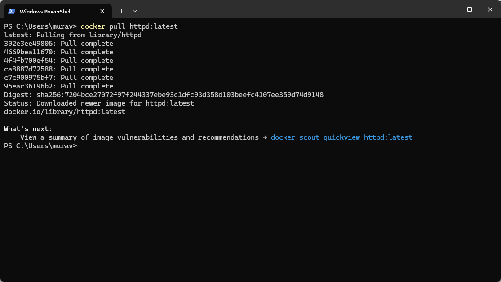
* Запустите новый контейнер на основе образа httpd. При этом установите соответствие порта 80 на компьютере порту 80 в контейнере
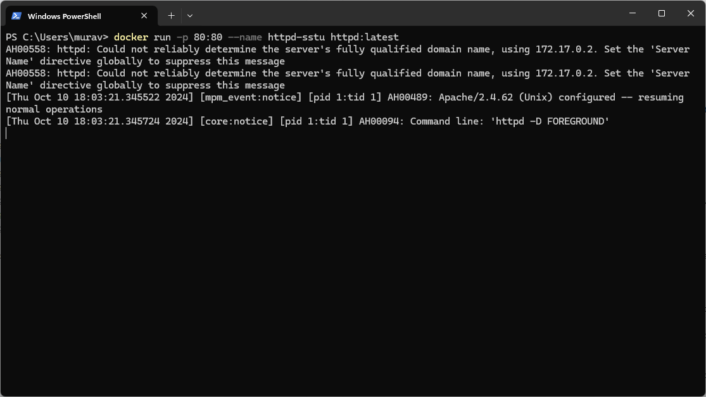
* Проверьте работоспособность развернутого в контейнере веб-сервера, обратившись к нему по http-протоколу (http://localhost:80)
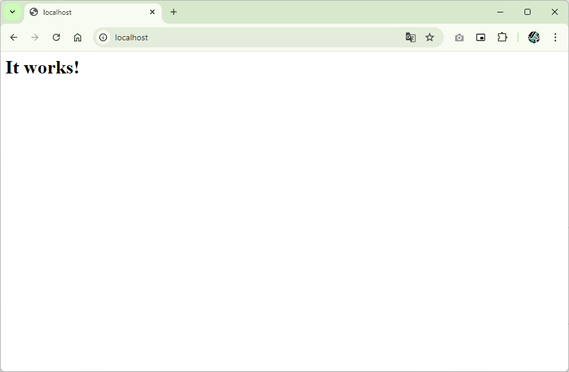
* Создайте на компьютере папку, добавив туда несколько небольших файлов (любых)
* На основе одного из ранее созданных образов запустите контейнер, указав соответствие папки в контейнере папке на компьютере (docker run -v)
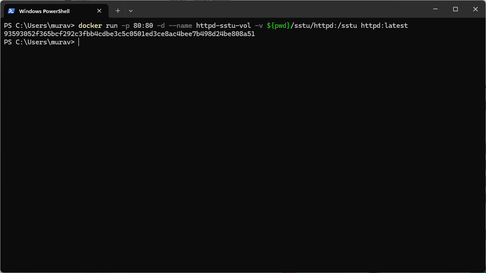
* Убедитесь в том, что изменения, вносимые в папку в контейнере, отображаются в папке на компьютере и наоборот
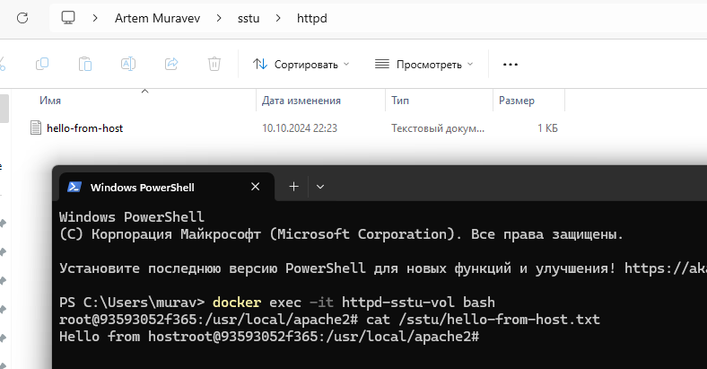
* Создайте dockerfile, в котором опишите логику создания нового образа на основе существующего образа alpine. В новом образе должен обновляться менеджер пакетов apk, устанавливаться текстовый редактор. Также в новом образе должна быть скопирована директория с файлами (любыми). 
Предусмотрите также установку переменной окружения AUTHOR, в качестве значения которой выступает ваша фамилия.
```dockerfile
FROM alpine:latest
RUN apk update
RUN apk add vim
COPY alpine-detach.json /alpine-detach.json
ENV AUTHOR=muravev
```
* Создайте образ на основе созданного ранее dockerfile. Создайте контейнер и проверьте результат действий, прописанных в dockerfile. (docker build, docker run)
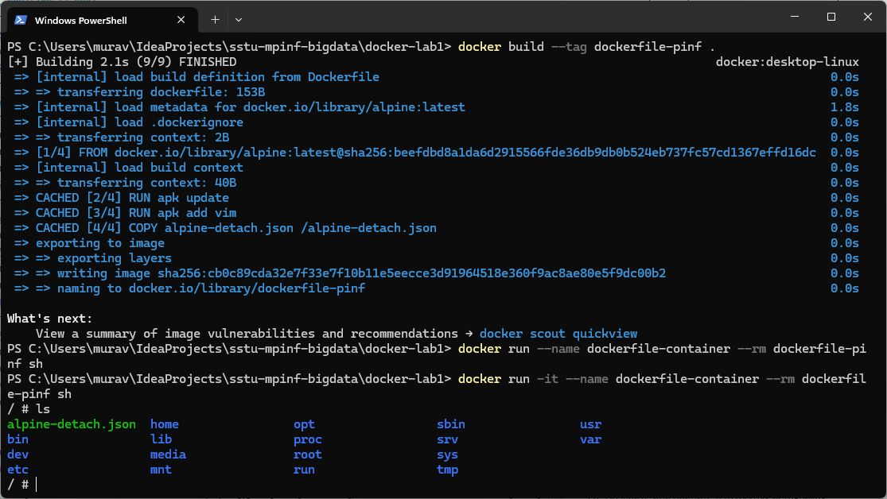
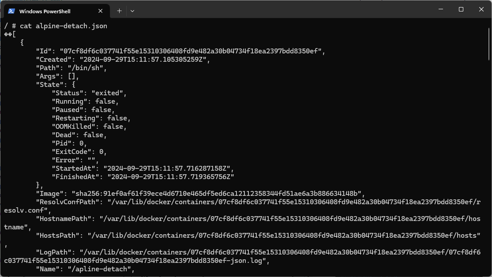
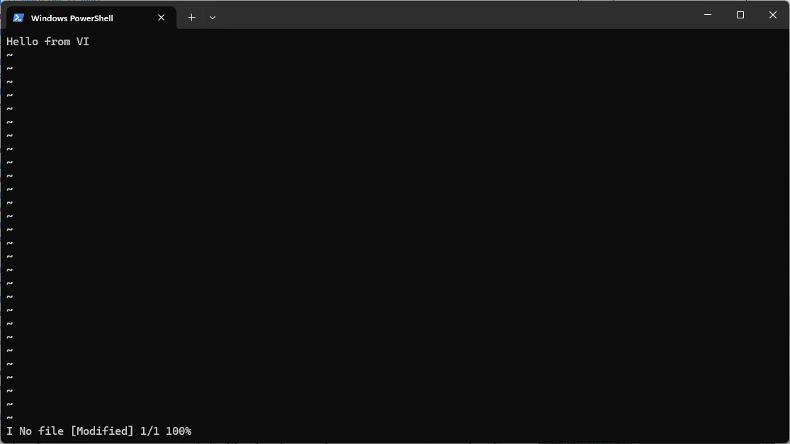
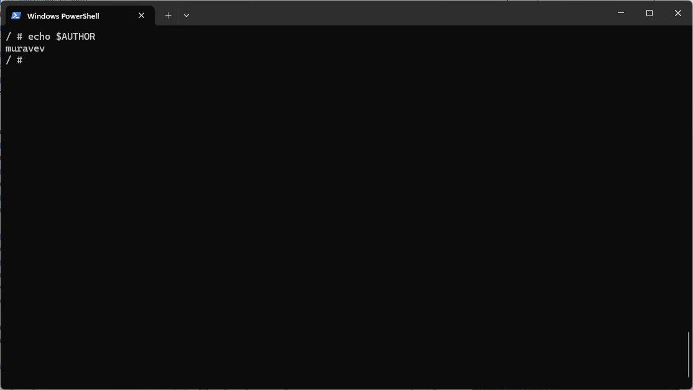
* Создайте или найдите в открытых источниках compose-файл, описывающий кластер Hadoop. Кластер должен включать в себя главный узел, как минимум, 3 дочерних узла и прочие вспомогательные компоненты. Изучите все конструкции, из которых состоит compose-файл.
```yaml
version: "3"

services:
  namenode:
    image: apache/hadoop:3
    hostname: namenode
    ports:
      - 9870:9870
    env_file:
      - ./config
    environment:
      ENSURE_NAMENODE_DIR: "/tmp/hadoop-root/dfs/name"
    command: ["hdfs", "namenode"]
  datanode1:
    image: apache/hadoop:3
    command: [ "hdfs", "datanode" ]
    env_file:
      - ./config
    volumes:
      - ./datanode1:/hadoop/dfs/data
  datanode2:
    image: apache/hadoop:3
    command: [ "hdfs", "datanode" ]
    env_file:
      - ./config
    volumes:
      - ./datanode2:/hadoop/dfs/data
  datanode3:
    image: apache/hadoop:3
    command: [ "hdfs", "datanode" ]
    env_file:
      - ./config
    volumes:
      - ./datanode3:/hadoop/dfs/data
  resourcemanager:
    image: apache/hadoop:3
    hostname: resourcemanager
    command: [ "yarn", "resourcemanager" ]
    ports:
      - 8088:8088
    env_file:
      - ./config
  nodemanager:
    image: apache/hadoop:3
    command: [ "yarn", "nodemanager" ]
    env_file:
      - ./config
```
* Разверните инфраструктуру кластера Hadoop при помощи compose-файла. Проверьте её работоспособность. (docker compose up)
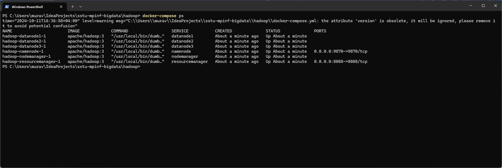
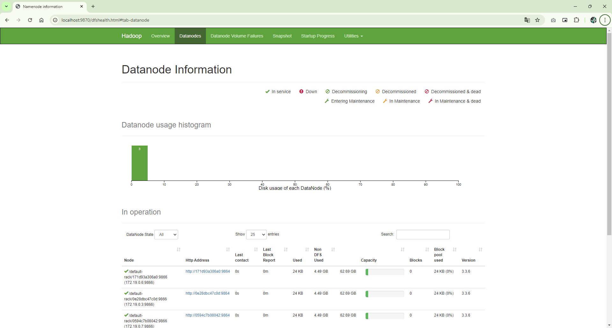
* Развернутый кластер. Сохраните его.