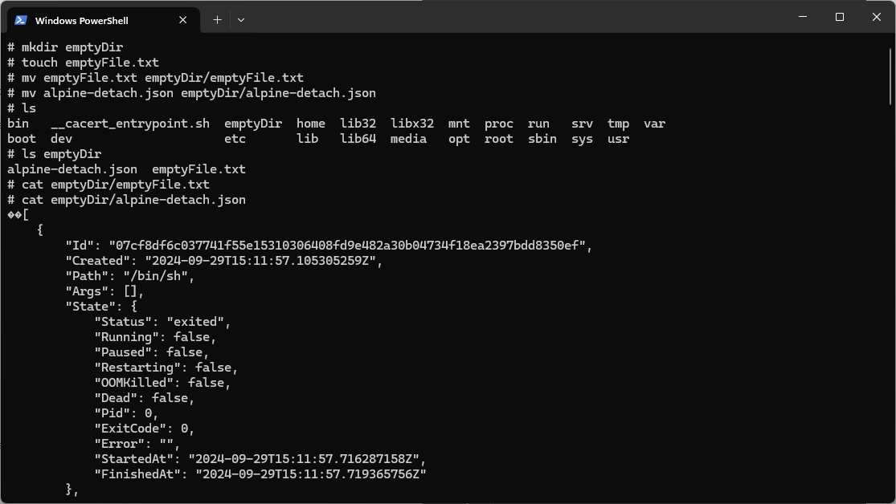

# мПИНФ - BigData
1. Установите Docker. Убедитесь в его работоспособности. Выведите информацию о Docker на экран (команды docker version, docker info)

2. Выведите список образов на экран (docker image ls)

3. Выведите список контейнеров на экран (docker container ls)

4. Скопируйте простейший образ alpine с репозитория docker hub (docker pull). Убедитесь, что он появился в Docker

5. Создайте и запустите на основе образа alpine два контейнера (в detach и attach режимах), указав для них названия. Покажите разницу между двумя режимами.

Detach: 

Attach:

6. Выведите на экран статистику запущенных контейнеров (docker stats)

7. Выведите на экран информацию о контейнере при помощи команды docker inspect

8. Выведите в новый файл информацию о контейнере при помощи команды docker inspect

[alpine-detach.json](alpine-detach.json)
9. Скопируйте созданный раннее файл в один из контейнеров (docker cp)

10. Перейдите в контейнер и запустите там командную оболочку (docker exec)

11. При помощи оболочки создайте в контейнере новую папку и новый пустой файл. Поместите пустой файл и ранее скопированный файл в новую папку (mkdir, cat, touch, mv)

12. Запустите новый контейнер и убедитесь в том, что внесенные раннее изменения в новом контейнере не отображаются

13. Остановите контейнер с изменениями (docker stop) и запустите его заново (docker start). Проверьте наличие там внесенных ранее изменений

14. В контейнере, где были внесены изменения, при помощи оболочки и менеджера apk установите утилиты sudo и vim (apk update, apk add vim, apk add sudo)

15. Внесите все изменения, которые есть на момент в контейнере в образ alpine (docker commit)
16. На основе существующего контейнера создайте новый образ (docker commit)
17. На основе изменённого образа создайте новый контейнер и убедитесь, что там отображаются все внесенные изменения (docker run)
18. Скачайте из репозитория Docker Hub образ httpd (docker pull)
19. Запустите новый контейнер на основе образа httpd. При этом установите соответствие порта 80 на компьютере порту 80 в контейнере
20. Проверьте работоспособность развернутого в контейнере веб-сервера, обратившись к нему по http-протоколу (http://localhost:80)
21. Создайте на компьютере папку, добавив туда несколько небольших файлов (любых)
22. На основе одного из ранее созданных образов запустите контейнер, указав соответствие папки в контейнере папке на компьютере (docker run -v)
23. Убедитесь в том, что изменения, вносимые в папку в контейнере, отображаются в папке на компьютере и наоборот
24. Создайте dockerfile, в котором опишите логику создания нового образа на основе существующего образа alpine. В новом образе должен обновляться менеджер пакетов apk, устанавливаться текстовый редактор. Также в новом образе должна быть скопирована директория с файлами (любыми). 
Предусмотрите также установку переменной окружения AUTHOR, в качестве значения которой выступает ваша фамилия.
25. Создайте образ на основе созданного ранее dockerfile. Создайте контейнер и проверьте результат действий, прописанных в dockerfile. (docker build, docker run)
26. Создайте или найдите в открытых источниках compose-файл, описывающий кластер Hadoop. Кластер должен включать в себя главный узел, как минимум, 3 дочерних узла и прочие вспомогательные компоненты. Изучите все конструкции, из которых состоит compose-файл.
27. Разверните инфраструктуру кластера Hadoop при помощи compose-файла. Проверьте её работоспособность. (docker compose up)
28. Развернутый кластер. Сохраните его.